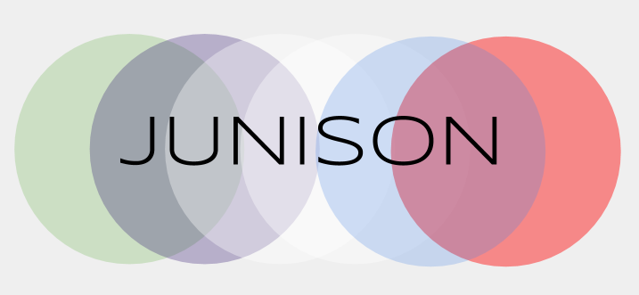
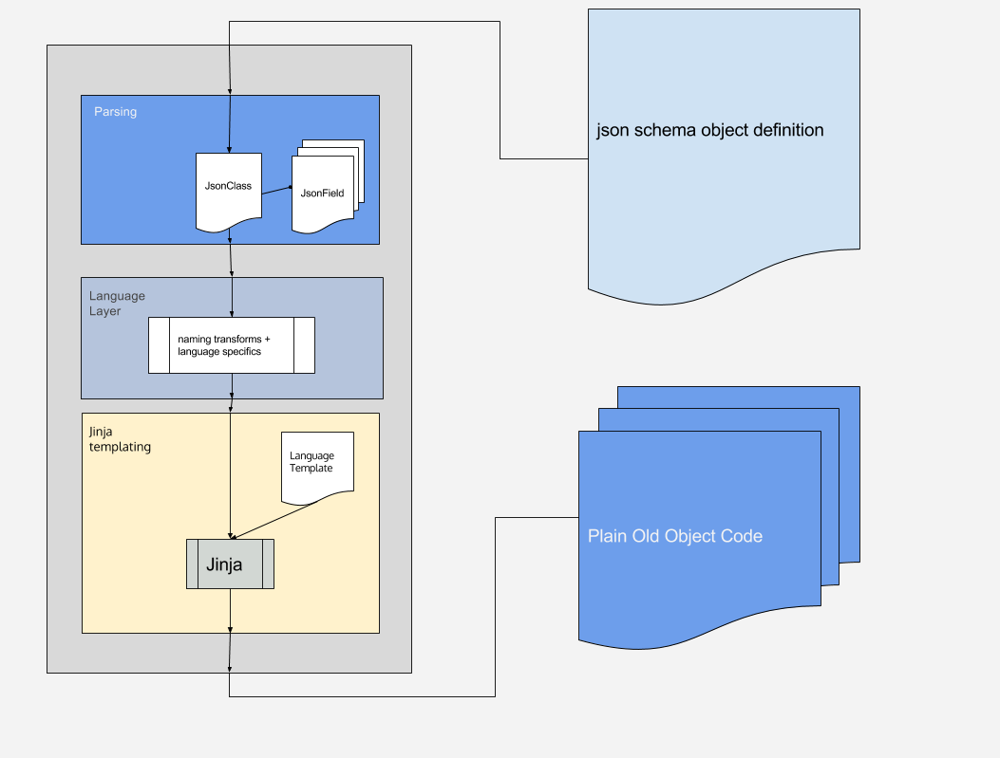

#Junison

A simple python library to generate Plain Old Objects in many languages



## Discalimer
This tool is still under development.  
I am an android developer. (not a python one). 
I don't really know php and other languages currently in templates.
So all feedbacks/contributions will be welcomed.


## Json schemas

Describe your model objects using  the json schema notation.
http://json-schema.org/

This project is deeply inspired by the philosophy of 
[jsonschema2pojo](https://github.com/joelittlejohn/jsonschema2pojo/)

Notably the use of extends notation for declaring inheritance.
```
```


## How to work with

TODO
In the meantime you can have a look on tests/RunDemo.py


## Modify templates to your needs

Thanks to jinja you can easily customize the generation.
 

## Design principles

